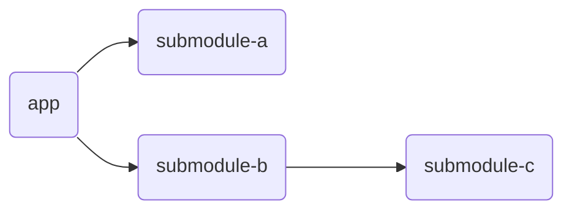

# Setupapp gradle plugin
Adds resources from dependent gradle modules to the target jar file with filtering environment folders (also supports jsMain target).

## Setup

- Kotlin DSL:
```kotlin
plugins {
    id("ru.raysmith.setupapp") version "1.4"
}
```
- Groovy:
```groovy
plugins {
    id 'ru.raysmith.setupapp' version '1.4'
}
```
- With TOML:
```toml
[plugins]
setupapp = { id = "ru.raysmith.setupapp", version = "1.4" }
```
```kotlin
@Suppress("DSL_SCOPE_VIOLATION")
plugins {
    alias(libs.plugins.setupapp)
}
```

## Usage
Let's imagine that we want to inheritance all resources from dependent modules in this project:
```
project
├── app
│   ├── src
│   │   └── main
│   │       ├── kotlin
│   │       └── resources
│   │           └── index.html
│   └── app.gradle.kts
├── submodule-a
│   ├── src
│   │   └── main
│   │       ├── kotlin
│   │       └── resources
│   │           ├── somefile.txt
│   │           ├── dev
│   │           │   └── foo.properties
│   │           ├── prod
│   │           │   └── bar.properties
│   │           └── folder
│   │               └── doc.pdf
│   └── submodule-a.gradle.kts
├── submodule-b
│   ├── src
│   │   └── main
│   │       ├── kotlin
│   │       └── resources
│   │           └── image.jpg
│   └── submodule-b.gradle.kts
├── submodule-c
│   ├── src
│   │   └── main
│   │       ├── kotlin
│   │       └── resources
│   │           ├── dev
│   │           │   └── secret.json
│   │           └── prod
│   │               └── secret.json
│   └── submodule-c.gradle.kts
└── build.gradle.kts
```



In `app.gradle.kts`:
```kotlin
setupapp {
    
}
```

After creating the JAR file with `gradle :app:shadowJar -Denv=dev`, its structure is:
```
app.jar
├── index.html
├── somefile.txt
├── foo.properties
├── folder/doc.pdf
├── image.jpg
└── secret.json (from dev)
```
> Don't forget run `gradle :app:clean` after change env

### Configuration
You don't need to configure any properties if you are using only the `dev` and `prod` environments. 
In other cases there are properties:

| name       | type        | default                     | description                                                                                                  |
|------------|-------------|-----------------------------|--------------------------------------------------------------------------------------------------------------|
| env        | String      | dev                         | Current environment                                                                                          |
| envs       | Set<String> | [dev, prod]                 | Set of all environments                                                                                      |
| prod       | Boolean     | env == dev                  | If it is true plugin will be used output from `jsBrowserProductionWebpack` for modules with `jsMain` targets |
| sourceSets | Set<String> | [main, commonMain, jvmMain] | List of sourceSet from which resources should be inherited                                                   |

#### Example
``` kotlin
setupapp {
    env.set(env())
    envs.set(setOf("dev", "prod", "sandbox"))
    prod.set(env() == "prod")
    sourceSets.set(setOf("commonMain", "jvmMain", "jsMain"))
}
```